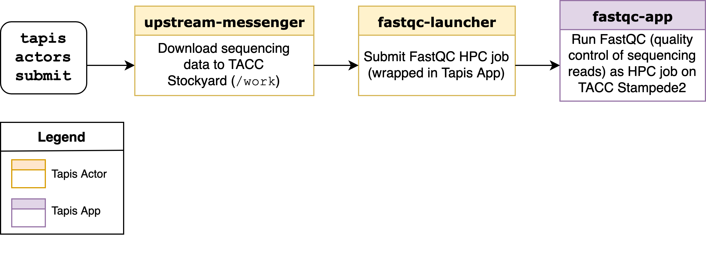

Deploying a Sequencing Pipeline
=============================

Introduction
------------

Thus far, we have demonstrated several useful features of actors:

* Deployment, execution, and handling using Tapis CLI
* Logging to 3rd party services (Slack in our example)
* Inter-Actor messaging

In this section of the tutorial, we will demonstrate this toolbox in a realistic example: a basic pipeline for
validating DNA sequencing data.

We will leverage a few additional Actor capabilities beyond what we have covered previously:

* Actors can interact with TACC filesystems such as ``/work``
* Actors can submit HPC jobs, by submitting to Tapis Applications

Reusing as much of our previous work as possible, pipeline deployment will consist of the following steps:

* Deploy a Tapis App ``eho-fastqc-0.11.9`` that runs the `FastQC tool <https://github.com/sequana/fastqc>`_ as HPC job
* Deploy new actor ``fastqc-launcher``
* Change ``upstream-messenger`` so it uploads a fastq data file from the web to TACC Stockyard filesystem
* Re-deploy ``upstream-messenger`` so it sends the path to data file to the ``fastqc-launcher``

Since deploying Tapis Apps is outside the scope of this tutorial, I have already completed the first step. 
If you are interested in learning how to deploy Tapis Applications, I encourage you to consult
one of our `in-depth Tapis tutorials <https://tacc-cloud.github.io/summer-institute-2021-tapis/>`_ .

Deploy a New Actor ``fastqc-launcher``
----------------------------------------

Here, we will create an Actor that launches an submits an HPC job to a 
Tapis App. Recall that Tapis Apps are wrappers around computationally intensive processes. They are similar
to Actors in that they can be managed using the Tapis API, but unlike Actors, they are HPC jobs under the
hood.

Similar to the ``upstream-messenger``, this new Actor (which we will call ``fastqc-launcher``) leverages the active Tapis client 
to interact with the Tapis ecosystem. In this case, we will submit to a 
Tapis Application instead of messaging another Actor. We instantiate a new 
Actor as before:

.. code:: bash

   tapis actors init --template default --actor-name fastqc-launcher
   cd fastqc_launcher
   echo '{}' > secrets.json

We edit the Actor source code in ``default.py`` so it resembles:

.. code:: python

   import os
   from agavepy.actors import get_context, get_client

   def main():
      context = get_context()
      fastq_uri = context['raw_message']
      print("Actor received message: {}".format(fastq_uri))

      # Usually, one would perform some input validation before submitting
      # a job to a Tapis App. Here, we simply validate that the path looks
      # like a Tapis/Agave URI
      assert fastq_uri.startswith('agave://')

      # Get an active Tapis client
      client = get_client()

      # Using our Tapis client, submit a job to Tapis App eho-fastqc-0.11.9
      body = {
         "name": "fastqc-test",
         "appId": "eho-fastqc-0.11.9",
         "archive": False,
         "inputs": {
            "fastq": "agave://eho.work.storage/{}".format(os.path.basename(fastq_uri))
         }
      }
      response = client.jobs.submit(body=body)
      print("Successfully submitted job {} to Tapis App {}".format(response['id'], response['appId']))

   if __name__ == '__main__':
       main()
   
We can deploy this new Actor as usual, by building, pushing, and registering the custom Docker
image as a new Actor:

.. code-block:: bash

   $ docker build -t taccuser/fastqc-launcher:0.0.1 .
   $ docker push taccuser/fastqc-launcher:0.0.1
   $ tapis actors create --repo taccuser/fastqc-launcher:0.0.1 \
                         -n fastqc-launcher \
                         -d "Submits job to FastQC Tapis App"

Edit ``upstream-messenger`` Source
----------------------------------

Using your favorite text editor, edit the ``default.py`` for ``upstream-messenger`` so it looks like:

.. code:: python

   import os
   from agavepy.actors import get_context, get_client
   import requests

   def main():
      """Main entrypoint"""
      context = get_context()
      m = context['raw_message']
      print("Actor received message: {}".format(m))

      # Get an active Tapis client
      client = get_client()

      # Pull in the downstream Actor ID from the environment
      downstream_actor_id = context['DOWNSTREAM_ACTOR_ID']
      # alternatively:
      # downstream_actor_id = os.environ['DOWNSTREAM_ACTOR_ID']

      # Using our Tapis client, 
      # upload our fastq file to TACC Stockyard using 
      url = https://raw.githubusercontent.com/eho-tacc/fastqc_app/main/tests/data_R1_001.fastq
      systemId = 'eho.work.storage'
      files_resp = client.files.files.importData(
         filePath='example.fastq', fileToUpload=None, 
         systemId=systemId, urlToIngest=url)
      print(files_resp)
      
      # Using our Tapis client, send the message containing file path 
      # to the downstream Actor
      message = "agave://{}/{}".format(systemId, files_resp['path'])
      print("Sending message '{}' to {}".format(message, downstream_actor_id))
      response = client.actors.sendMessage(actorId=downstream_actor_id, body={"message": message})
      print("Successfully triggered execution '{}' on actor '{}'".format(response['executionId'], downstream_actor_id))

   if __name__ == '__main__':
       main()

Re-deploy Actor ``upstream-messenger``
--------------------------------------

Our Actor ``upstream-messenger`` is still configured to send messages to ``hello-world-actor``. 
We would instead like it to send messages to our new actor ``fastqc-launcher``, so we must
update it with a new ``DOWNSTREAM_ACTOR_ID``. Instead of deleting and deploying a new
Actor, we can instead:

* Build and push an updated Docker image
* Update the ``DOWNSTREAM_ACTOR_ID`` variable using ``tapis actors update``

.. code:: bash

   $ docker build -t enho/upstream-messenger:0.0.2 .
   $ docker push enho/upstream-messenger:0.0.2
   $ tapis actors update --repo taccuser/upstream-messenger:0.0.2 \
                         -e DOWNSTREAM_ACTOR_ID=$FASTQC_LAUNCHER_ID \
                         MDfoobar7AOwx
   +----------------+-----------------------------------+
   | Field          | Value                             |
   +----------------+-----------------------------------+
   | id             | MDfoobar7AOwx                     |
   | name           | upstream-messenger                |
   | owner          | taccuser                          |
   | image          | taccuser/upstream-messenger:0.0.2 |
   | lastUpdateTime | 2021-08-26T20:33:20.320620        |
   | status         | SUBMITTED                         |
   | cronOn         | False                             |
   +----------------+-----------------------------------+

Send Message to ``upstream-messenger`` Using CLI
~~~~~~~~~~~~~~~~~~~~~~~~~~~~~~~~~~~~~~~~~~~~~~~~

Once the ``upsteam_messenger`` Actor is READY, we can trigger a new
execution by sending it a message:

.. code:: bash

   $ tapis actors submit -m 'hello, FastQC pipeline!' MDfoobar7AOwx
   +-------------+----------------------------+
   | Field       | Value                      |
   +-------------+----------------------------+
   | executionId | MDanexec7AOwx              |
   | msg         | hello, FastQC pipeline!    |
   +-------------+----------------------------+

As usual, we check the status of the execution, and show the logs when
it finishes:

.. code:: bash

   $ tapis actors execs show MDfoobar7AOwx MDanexec7AOwx
   +-----------+-----------------------------+
   | Field     | Value                       |
   +-----------+-----------------------------+
   | actorId   | MDfoobar7AOwx               |
   | apiServer | https://api.tacc.utexas.edu |
   | id        | MDanexec7AOwx               |
   | status    | COMPLETE                    |
   | workerId  | wZvworker1KmQ               |
   +-----------+-----------------------------+
   $ tapis actors execs logs MDfoobar7AOwx MDanexec7AOwx
   Actor received message: hello, FastQC pipeline!
   Sending message 'greetings, hello-world-actor!' to MqqbarbazBB8x
   Successfully triggered execution '5P7foobarrrA6' on actor 'MqqbarbazBB8x'

Check Execution of Downstream ``fastqc-launcher``
~~~~~~~~~~~~~~~~~~~~~~~~~~~~~~~~~~~~~~~~~~~~~~~

Let’s check the status of the execution and inspect the logs:

.. code:: bash

   $ tapis actors execs show MqqbarbazBB8x 5P7foobarrrA6 
   +-----------+-----------------------------+
   | Field     | Value                       |
   +-----------+-----------------------------+
   | actorId   | MqqbarbazBB8x               |
   | apiServer | https://api.tacc.utexas.edu |
   | id        | 5P7foobarrrA6               |
   | status    | COMPLETE                    |
   | workerId  | DJPworkerzKlN               |
   +-----------+-----------------------------+
   # TODO
